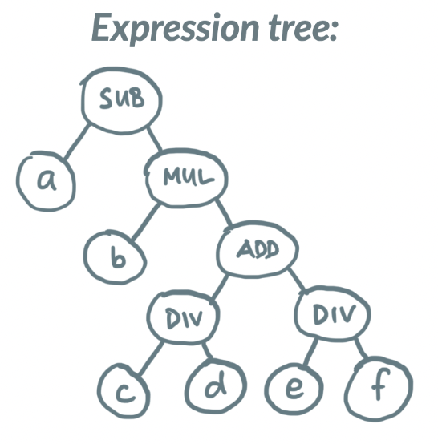

## Authors: Wenyun Wang, Anqi Chen, Emma Ton, Williams Walt, Zhang Wu

## Introduction

There are many problems in modern computation that require computing gradients and derivatives of complex functions. From calculating the movement or flow of electricity, motion of an object to and from like a pendulum, to explaining thermodynamics concepts, solving differential equations is essential for science and engineering. 

In the case of extremely complicated functions such as neural networks, the calculation and storage of these derivatives can be quite complex and cumbersome. The problem grows even worse when taking into account that the input to these functions can be extremely high-dimensional. To this end we introduce AutoDiffPython, a library for Automatic Differentiation that provides users a simple and intuitive API for the automatic calculation and storage of derivatives.

## Background

**Automatic Differentiation** is a method of computing the derivative of a function using a computer program. 

Unlike symbolic differentiation - which requires manual calculations and exponential runtime - and numerical differentiation - which fails to give an accurate approximation when the error is too small or too large, automatic differentiation can **achieve machine precision** in constant time. 

To evaluate the derivative of a function using automatic differentiation, we decompose complex functional forms into a series of elementary function operations based on the order math is carried out by definition. After the decomposition, any complicated analytical formula of the original function can be represented by a computational graph. The independent variables and the outermost function will be the input and output of this graph. All intermediate variables will form a computational network in between, as is shown in the following example: 

$$f(x) = \pi x^2 + sin(3e^x + 7x) - e^x$$


In this graphical representation, all dependent variables show up as nodes connected through elementary operations. By zooming in to a single parent-child node structure, we observe that the value of each dependent variable node can be evaluated once the value of all its parent nodes are given. 

To evaluate the derivatives of each dependent variable, we should recall the chain rule: 

$$\frac{\partial f}{\partial x} = \frac{\partial f}{\partial u}\frac{\partial u}{\partial x}$$

Therefore, the derivative of each child node variable with respect to a given direction in the independent variable space can be evaluated given the derivatives of all its parent nodes in that direction, as well as the value of the parent node variables. The series of values of dependent variables form the primal trace of the computational graph. The series of directional derivatives of the dependent variables form the tangent trace of the computational graph.

The actual evaluation of the primal and tangent trace depend on a tool structure - the dual number. A dual number z is written as $z=a+\epsilon b$, where a and b are real numbers while $\epsilon$ is a nilpotent number satisfying $\epsilon^2=0$ and $\epsilon \neq 0$. 

Once we store the value of a dependent variable as a, the real part of the dual number, and the directional derivative of a dependent variable as the b, the dual part of the dual number, the special properties of a dual number structure enables the combined evaluation of the primal trace and the tangent trance of a given parent-child node with dual number operation. 

The forward mode autodiff part of our package is implemented by defining the dual number structure, overloading dual number operations and evaluating node-by-node in the computational graph the dependent variables and their directional derivatives. 

## How to Use Our Package

You will first need to create a virtual environment based on the version of Python interpreter you are using.

- Step1. Change into a working directory where you want to install the package:
```
$ cd ./YOUR_WORKING_DIRECTORY
```

- Step2. Create a .gitignore file in your working directory with the following:
```bash
$ echo '/test_env' >.gitignore
```

- Step3. Create your virtual Python environment by running the following command:
```python
$ python -m venv test_env
```

- Step4. Activtate the virtual enviornment with the following command:
```bash
$ source test_env/bin/activate
```

- Step5. Install our package

```bash
$ python3 -m pip install AutoDiffPython
```

- Step6. Install the Numpy Library
```bash
$ pip install numpy==1.22.3
```

- Step7. Create a demo.py file
```bash
$ vim demo.py
```

- Step8. Import the modules from our package in your demo.py file:
```python
from autodiff.trig import *
from autodiff.autoDiff import ForwardDiff
from autodiff.autoDiff import ReverseDiff
from autodiff.reverse import Node
```

- Step9. Now you can start implement your own simple or more complex algorithms using the automatic differentiation either with ForwardDiff or ReverseDiff. A basic demo of a simple example is provided below:

```python
#!/usr/bin/env python3

from autodiff.trig import *
from autodiff.autoDiff import ForwardDiff
from autodiff.autoDiff import ReverseDiff
from autodiff.reverse import Node

def main():
    """
    Demo of a simple example with forward mode automatic differentiation

    Description: calculate the directional derivative and Jacobian of func = ∑Xi, 
    where Xi is the component in 2D dimensions, at the point x=[1,1] and direction p=[1,1]
    """
    
    # Note: if you have multiple function as inputs, you can just instantiate multiple objects of ForwardDiff or ReverseDiff class, with each corresponding to one of the function inputs

    # For scalar functions
    # Step 1: Define function
    function = lambda x: x * x

    
    # Step 2: Create forward mode autodifferentiation object
    forward_autodiffer =  ForwardDiff(function)
    
    # Step 3: Evaluate derivative of function at certain point
    dfdx = forward_autodiffer.derivative(x=3) # This will evaluate the derivative at x=3 so it will return 6 in this case
    
    
    # For vector valued functions
    # Step 1: Define function
    func = lambda x: x[0] + x[1]

    # Step 2: Create autodifferentiation object
    obj = ForwardDiff(func)
    print(obj.f)
    
    # Step 3: Find directional derivative and Jacobian of function (need to specify p for directional derivatives)
    print(obj.derivative(x =[1,1], p = [1,1]))
    print(obj.Jacobian([1,1]))


    """
    Demo of a simple example with reverse mode automatic differentiation

    Description: calculate the Jacobian of func = a-b+sin(c/d+e/f) + b*c, 
    where a,b,c,d,e,f are the multi-inputs for the function, at the test_vector = [0,1,2,3,4,5]
    """
    # Step 1: Intialize the vi (i<=0) nodes
    a,b,c,d,e,f = [Node(k) for k in list('abcdef')]
    for node,i in zip([a,b,c,d,e,f],range(len(list('abcdef')))):
        node.value = i
        print(node)   

    # Step 2: Define an express function and parse an expression tree
    func = lambda x: x[0]-x[1]+sin(x[2]/x[3]+x[4]/x[5]) + x[1]*x[2]
    tree = a-b*(c/d+e/f) 
    print(tree) # print the expression tree
    
    # Step 3: Create reverse mode autodifferentiation object
    reverse_autodiffer =  ReverseDiff(func)
    
    # Step 4: Evaluate jacobian of function at certain point represented by test_vector
    test_vector = [0,1,2,3,4,5]
    print(reverse_autodiffer.Jacobian(test_vector))


if __name__ == "__main__":
    main()
```

- Step10. Run the demo.py with the following command:
```bash
$ chmod +x demo.py
$ ./demo.py
```

- Step11. Deactivate the virtual environment with the following command:
```python
$ deactivate
```

## Software Organization
### Directory Structure
```
AutoDiffPython/
├── __init__.py
|
└── autodiff/
    ── __init__.py
        ├── autoDiff.py
        ├── dual.py
        ├── reverse.py
        ├── trig.py        
|
├── tests/
│   ├── __init__.py
│   └── test_autoDiff.py
│   └── test_dual.py
│   └── test_reverse.py
│   └── test_trig.py
|
├── .DS_Store
├── .gitignore
├── LICENSE
├── README.md  
├── check_coverage.py    
├── requirements.txt     
├── run_tests.sh
├── pyproject.toml

```

### Basic Modules and Their Functionalities
- autoDiff module that defines both ForwardDiff and ReverseDiff class to compute the derivative of a function at a given point x and direction p or the Jacobian at a given point x with forward mode and reverse mode automatic differentiation, respectively. It will return a numpy array that represents the directional derivative or the Jacobian of the function that was passed to it. 

- dual module that defines the Dual class which overloads basic and comparison operators of +, -, *, ^, /, negation, =, <, >, <=, >=, !=, etc for dual numbers.

- trig module that overloads the basic trigonometric operators of sin, cos, tan, log, log10, log2, sinh, cosh, tanh, exp, sqrt, power, arcsin, arccos, arctan and etc for dual numbers as well as Node objects.

- reverse module that defines the Node class which overloads basic and comparison operators of +, -, *, ^, /, negation, =, <, >, <=, >= for Node objects, calculates the corresponding value, forward pass and reverse pass (sensivity) of a node in a expression tree as well as prints the expression tree. The reverse module works by parsing an expression tree by exploiting opertor precedence built into python, which allows to build the tree automatically. The value, forward pass and reverse pass (sensivity) of a node in the expression tree are calculated with recursion.

### Code Testing
- We use CI to perform tests and the tests live in the tests folder. We also generate a code coverage report for the test suites.

### How to Install Our Package

Our package is released on PyPI. Therefore, you will be able to easily pip install our package with the following command:
```bash
$ python3 -m pip install AutoDiffPython
```

## Implementation Details

### Core Data Structures
Within the autodiff subpackage, dual numbers will be created as an instance of Dual class, which stores its real and dual parts as attributes and also has methods for operations. The multiple inputs of a function is stored as an array. Node objects will be created as an instance of Node class, which stores the key, value, forward pass and reverse pass of itself and also its child nodes as attributes. By parsing an expression tree with the exploit of opertor precedence built into python, a binary tree which represents the structure of the computational graph is automatically build. Each node represents a node associated to intermediate variable vj in the computational graph, with its children being the child node of vj.

### Core Classes and Important Attributes
- Dual class

The Dual class has name attributes of real and dual, where the real stores the real part (i.e. function value) of a dual number, and the dual part stores the dual part (i.e., first-order derivative of a function. The methods includes basic and comparison operations for dual numbers such as +, -, *, ^, /, negation, =, <, >, <=, >=, !=, etc.

- Node class

The Node class has name attributes of key, left, right, left_partial, right_partial, operation, sensitivity which stores the key, the value of left child node, the value of left right node, the forward pass of left child node, the forward pass of right child node, the reverse pass of left child node, the reverse pass of right child node, respectively. The methods include basic and comparison operations for node objects such as such as +, -, *, ^, /, negation, =, <, >, <=, >=, !=, etc, calculating the value, forward pass and reverse pass of a node recursively (_eval for calculating the value and forward pass and _sens for calculting the reverse, respectively), as well as pretty print the expression tree. Importantly, it also has the reset method which clear the node structure and intialize a new one upon when the user input a new function.

- ForwardDiff class

The ForwardDiff class has name attributes of function, which is taken in from the user input. It has methods of derivative (calculates the directional derivative of the target function at a given point in a specific direction), and Jacobian(calculats the Jacobian of the target function at a given point).

- ReverseDiff class

The ReverseDiff class has name attributes of function, which is taken in from the user input. It has methods of Jacobian which calculats the Jacobian of the target function at a given point.


### External Dependencies
- NumPy Library

### Basic Operators, Comparison Operators and Elementary Functions

#### The basic operations for dual numbers are implemented as follow:

- Addition (commutative) (+): real=real1+real2, dual=dual1+dual2

- Subtraction (-): real=real1-real2, dual=dual1-dual2

- Multiplication (*) (commutative): real=real1*real2, dual=real1*dual2+dual1*real2

- Division (/): real=real1/real2, dual=(dual1*real2-real1*dual2)/real2**2

- Power (**): real and dual number part can be calculated by performing power(n) times multiplication operation with itself.

- Negation (-): real=-real, dual=-dual

#### The comparison operations for dual numbers are implemented as follow:

- __lt__ (less than): if (real1 < real2) return True(1) else False(0)

- __gt__ (greater than): if (real1 > real2) return True(1) else False(0)

- __le__ (less than or equal to): if (real1 <= real2) return True(1) else False(0)

- __ge__ (greater than or equal to): if (real1 >= real2) return True(1) else False(0)

- __eq__ (euqal to): if (real1 == real2) return True(1) else False(0)

- __ne__ (not equal to): if (real1 != real2) return True(1) else False(0)


#### The basic operations for node objects are implemented as follow:

- Addition (commutative) (+): node.value=node1.value+node2.value

- Subtraction (-): node.value=node1.value-node2.value

- Multiplication (*) (commutative): node.value=node1.value*node2.value

- Division (/): node.value=node1.value/node2.value

- Power (**): node.value=node1.value^(node2.value)

- Negation (-): node.value=-node1.value

#### The comparison operations for node objects are implemented as follow:

- __lt__ (less than): if (node1.value < node2.value) return True(1) else False(0)

- __gt__ (greater than): if (node1.value > node2.value) True(1) else False(0)

- __le__ (less than or equal to): if (node1.value <= node2.value) return True(1) else False(0)

- __ge__ (greater than or equal to): if (node1.value >= node2.value) return True(1) else False(0)

- __eq__ (euqal to): if (node1.value == node2.value) return True(1) else False(0)

- __ne__ (not equal to): if (node1.value != node2.value) return True(1) else False(0)

#### Method - Elementary Functions (Trig, Inverse trig, Exponentials, Hyperbolic, Logistic, Logarithms, Square root functions): 
Elementary functions for dual numbers are calculated with the formula: real=f(real1), dual=f'(real1)*dual1. For example: sin(dualnumber1)=sin(real1)+cos(real1)*dual1*ε

Elementary functions for node objects are calculated with the formula: 
node.value=f(node1.value).

## Extension
### New/Future Feature Section Updated Based on M2 Feedback
We will add an extension feature of reverse mode automatic differentiation in addition to the implementation of forward mode in milestone2. The software organization will change in the following aspects accordingly:
- Directory Struture
We will change the subdirectory 'forward' to 'autodiff' instead to include both the autoDiff and reverse module for forward and reverse mode, respectively. 

- New Modules, Classes, Data Structure
A new reverse module will be added with the definition of a new Node class which overloads basic and comparison operators of +, -, *, ^, /, negation, =, <, >, <=, >= for Node objects, calculates the corresponding value, forward pass and reverse pass (sensivity) of a node in a expression tree as well as prints the expression tree. The reverse module works by parsing an expression tree by exploiting opertor precedence built into python, which allows to build the tree automatically. The value, forward pass and reverse pass (sensivity) of a node in the expression tree are calculated with recursion. Also, we will update trig module to overload the operations for node objects in the autodiff subpackage as well the corresponding test_trig module in the tests subpackage. The autoDiff class in milestone2 will be renamed as ForwardDiff class, and we will add another new ReverseDiff class for calculating the Jacobian of a function using reverse mode automatic differentiation. As for the core data structure, node objects will be created as an instance of Node class, which stores the key, value, forward pass and reverse pass of itself and also its child nodes as attributes. By parsing an expression tree with the exploit of opertor precedence built into python, a binary tree which represents the structure of the computational graph is automatically build. Each node represents a node associated to intermediate variable vj in the computational graph, with its children being the child node of vj.


### Description of the Reverse Mode Extension
In the extension, we further implement the reverse mode automatic differentation with new features in addition to the mininum requirements:
- The users can choose either to instantiate an automatic differentiation object to be used in either the forward mode or reverse mode.

- Users can retrieve the whole computational graph by instantiate an object of the ReverseDiff class.

### Additional information or background needed to understand our extension
- Concept: parse an expression tree by exploiting operator precedence built into python, as covered in lecture17-18. An expression tree example with correspondence to the expression of a-b*(c/d+e/f) is shown below in the image copied from lecture18 slides.



```python
# Example code for parsing expression: a-b*(c/d+e/f)
>>> tree = a - b * (c / d + e / f)
>>> print(tree)
sub(a, mul(b, add(div(c, d), div(e, f))))

# Recursion calculation of value, forward pass and reverse pass implied by operator precedence
>>> tree = TreeNode.__sub__(a,
               TreeNode.__mul__(b,
                   TreeNode.__add__(
                       TreeNode.__truediv__(c, d),
                           TreeNode.__truediv__(e, f)
                   )
               )
           )
```

## Broader Impact and Inclusivity Statement 

- The potential broader impacts and implications of our software

Automatic differentiation, as one of the most basic and applicable tool needed almost in every disciplinary, where there are many problems in modern computation that require computing gradients and derivatives of complex functions. Therefore, building a library of automatic differentiation can have broader impact and implications for different applications, from calculating the movement or flow of electricity, motion of an object to and from like a pendulum, to explaining thermodynamics concepts, and even to more complicated functions such as neural networks, where the calculation and storage of these derivatives can be quite complex and cumbersome. In a more complex real world, the usage of the automatic differentiation software in more advanced commercial technique such as autonomous vehicles can lead to more important impacts on the living standards of people from many different aspects inculding security and well-being. 

- Software inclusivity to the broader community

Scientific research and professional work nowadays become more interdisciplinary. People in different fields including physics, mathematics, biology, chemistry, medicine and etc are gathered in academia or industry to tackle fundamental questions or big problems. To foster inclusivity, the developers of our software package come from different fields including computer science, applied physics, and engineering science to share collision of thoughts and help reduce individual bias and prejudice during software development. The software package provides a clearly structured written documentation that is easy understandable for the general public as potential users. Also, with python as one of the most popular and universal language in computer science, the package is easily accessible to the common community in science and engineering. And permission is granted free of charge to any person obtaining a copy of this software and associate documentation files, as indicated in the included MIT license file.

- Ethical Considerations

Feedback on the software is welcome for better communications and trouble-shooting potential problems. However, any unethical and illegal usage of our software package is not allowed. The copyright and the permission notice shall be included in all copies or substantial portions of our software.

## Future
Our package enables users to calculate the derivative and the jacobian of a function / multiple functions. Users can install our package and write complicated algorithms for applications in science and engineering, which include but not limited to:
- Newton's Method for finding approximate root of a function. A demo of the NewtonRootFinder for a scalar function is provided below:
```python
#!/usr/bin/env python3
"""
Description: a root finder based on Newton's method which calculate the the derivative at each each step and recursively updates the guessed_root of a function with the correction computed according to the derivative, until finally approaches the root of the function within certain covergence tolerance.

Requirements: the function needs to be differentiable.

Returns: the approximate root of a function with a given initial guess x.
"""

from autodiff.trig import *
from autodiff.autoDiff import ForwardDiff
from autodiff.autoDiff import ReverseDiff
from autodiff.reverse import Node

def NewtonRootFinder(func, x):
    x_k = x
    tolerance = 10**(-15)
    max_iter = 10000
    autodiffer =  ForwardDiff(func)
    def dfdx(x):
        return autodiffer.derivative(x)
    for k in range(max_iter):
        dx_k = -fun(x_k) / dfdx(x_k)
        if abs(dx_k) < tolerance:
            root: x_k + dx_k
            break
        x_k += dx_k
    return root

```


- Gradient Descent Algorithm for Optimization (finding mininum/maxinum position of a function). A demo of the GradientDescentOptimizer is provided below:
```python
#!/usr/bin/env python3
"""
Description: an gradient descent optimizer which calculate the the Jacobian at each each step and recursively travels from the starting point along the direction represent by the Jacobian, until finally approaches a local minimum of the function within certain precision.

Requirements: the function needs to be to be concave or convex with the region of interest (ROI), as well as being differentiable.

Returns: the trace of gradient descent optimization of a funciton with a given starting point x.
"""

from autodiff.trig import *
from autodiff.autoDiff import ForwardDiff
from autodiff.autoDiff import ReverseDiff
from autodiff.reverse import Node

def GradientDescentOptimizer(func, x):
    cur_x = np.array(x)
    rate = 0.01
    precision = 10**(-15)
    previous_step_size = 1
    max_iters = 10000
    iters = 0
    autodiffer = ForwardDiff(func)
    def jacobian(x):
        return autodiffer.Jacobian(x)
    df = lambda x: jacobian(x)
    trace = []
    while previous_step_size > precision and iters < max_iters:
        prev_x = cur_x
        cur_x = cur_x - rate * np.array(df(prev_x))
        previous_step_size = np.linalg.norm(cur_x - prev_x)
        iters = iters + 1
        trace.append(cur_x)
    return trace

```

- Inverse transform sampling: sampling (a million points for example) from a known cumulative distribution function (CDF). 

- Fit optimal weights to minimize the empirical risk function in training neural networks
